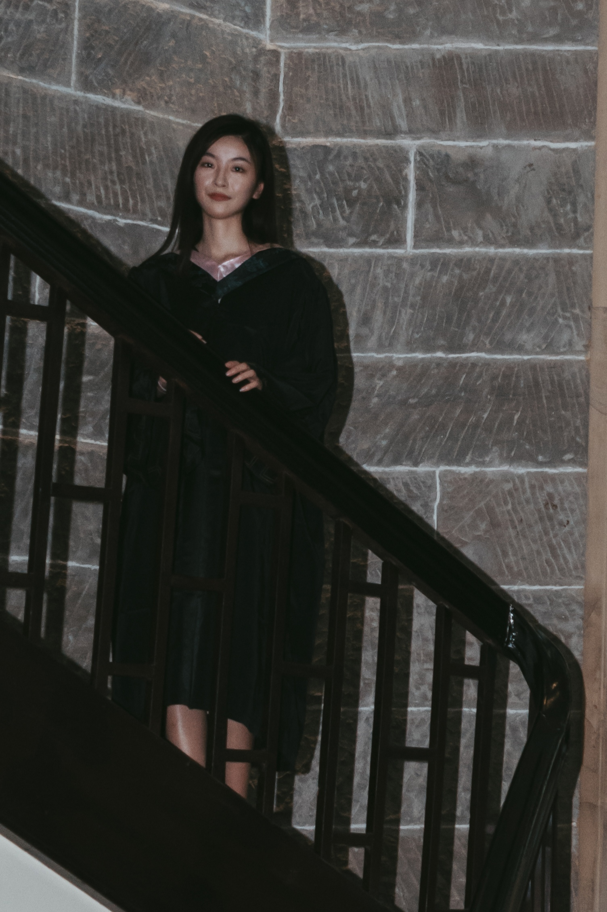

# About

## 个人简介

郑晓璇，南京大学商学院企业管理系硕士研究生，本科毕业于重庆大学会计学系。

---

## 研究经历

在学院一名会计系老师的指导下与其他两名同学共同参与项目的研究，采用因子分析等研究方法，运用Excel、 spss等统计软件对多家新旧媒体企业进行研究，旨在通过它们的财务绩效揭示在互联网+的背景下新旧媒体的企业活力。

---

## 社团和组织经历
### 校学生会
**学习部学业指导中心副主任**

* 领导组织中心成员举办数模大赛讲座活动，吸引一百余名学生前来参加。
* 构建在校学生学习交流平台“学霸工作室”，成功邀请学校来自各学院的40多名学霸组成“学霸联盟”，为同学进行答疑交流活动。
* 策划某一线影视明星来重庆大学的演讲活动，吸引近千名同学前来观看。
* 为校学生会公众号撰写并编辑多篇文章。

### 经管学院团委宣传部

* 参与学院组织的各项活动的宣传活动，如辩论赛、防艾宣传等活动的海报制作。

### 重庆大学艺术团合唱队
**女高音部队员**

* 曾与合唱队队员一起参加各种校园演出，并多次代表重庆大学参加校外演出，2018年经过每天的辛苦训练夺得了大学生艺术展演全国二等奖与重庆市一等奖。

---
## 荣誉奖项
* 重庆大学综合奖学金 （2017、2018）
* 全国大学生数学竞赛三等奖 （2018）
* 全国大学生艺术展演二等奖 （2018）
* 全国大学生艺术展演重庆赛区一等奖 （2018）
* 重庆大学宣讲团二等奖 （2017）
* 重庆大学宣讲团优秀个人（ 2017）

---

## 兴趣爱好
唱歌、绘画、电子琴、舞蹈

Note: Welcome to my virtual personal space.

